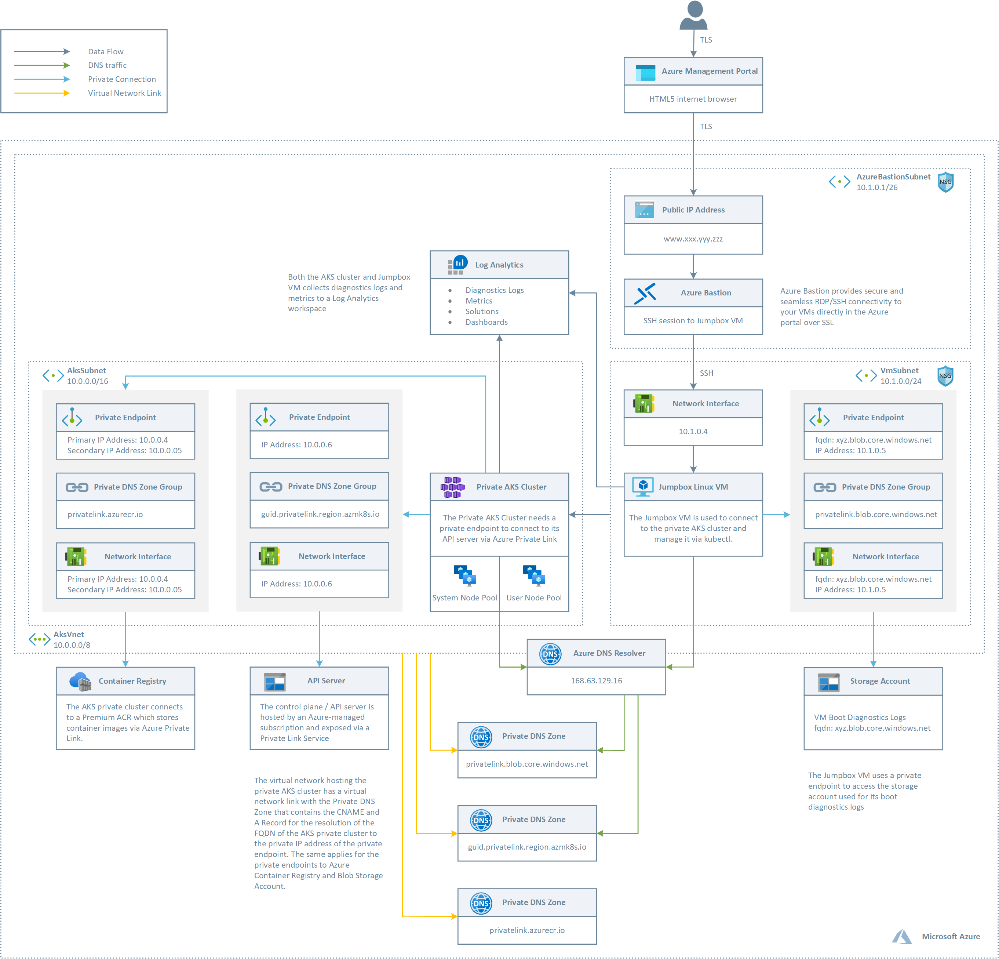
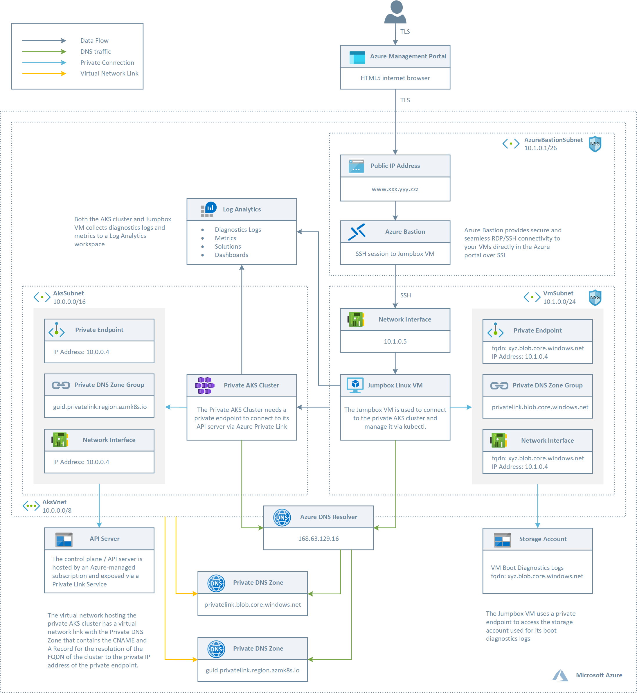
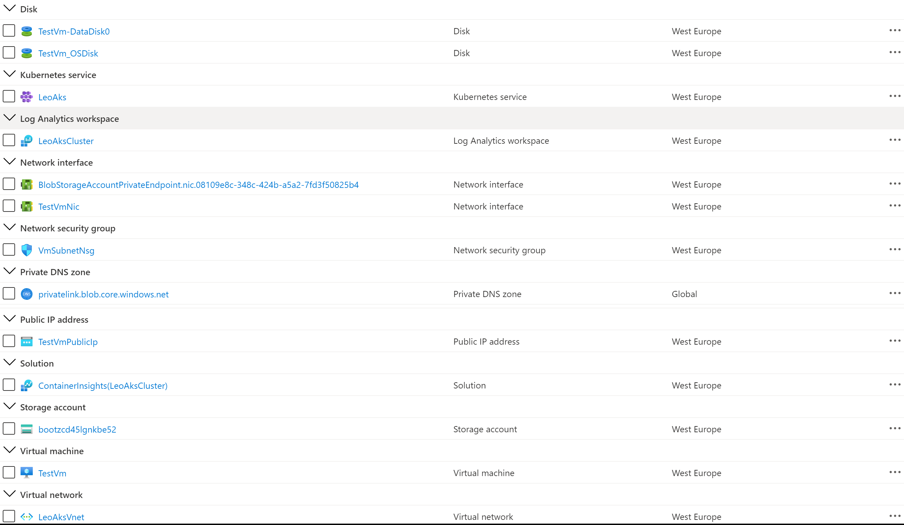
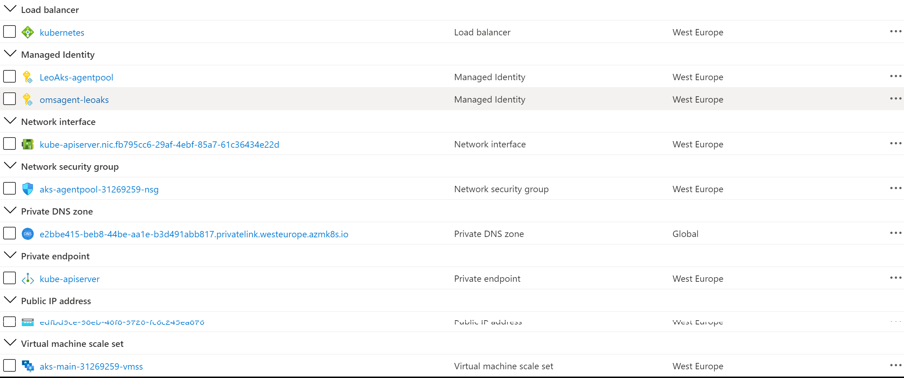
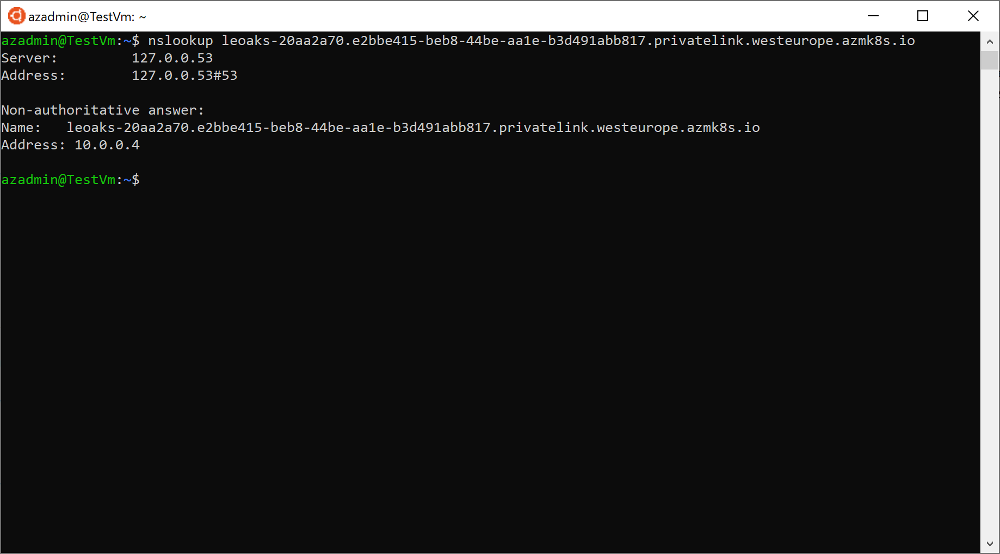

# Criando um cluster AKS privado na Azure #

Este template ARM inclui todas as últimas características como [clusters AKS privados](https://docs.microsoft.com/en-us/azure/aks/private-clusters), sendo simplificada [integração AAD gerenciada por AKS](https://docs.microsoft.com/en-us/azure/aks/managed-aad), o novo [Azure RBAC para autorização do Kubernetes](https://docs.microsoft.com/en-us/azure/aks/manage-azure-rbac), na visualização e no uso de [identidade gerenciada no lugar de um serviço principal](https://docs.microsoft.com/en-us/azure/aks/use-managed-identity), e mais. 

O terminal do servidor da API não possui endereço IP público. Para gerenciar o servidor API, você precisará usar uma máquina virtual que tenha acesso à Rede Virtual Azure (VNet) do cluster AKS. Portanto, o modelo ARM implanta um Jumpbox na mesma rede virtual que hospeda o cluster AKS privado. Existem várias opções para estabelecer a conectividade de rede ao cluster privado.

Crie uma máquina virtual na mesma rede virtual do Azure (VNet) que o cluster AKS.
Use uma máquina virtual em uma rede separada e configure o peering da rede virtual. Consulte a seção abaixo para obter mais informações sobre esta opção.
Use uma conexão Express Route ou VPN.
Criar uma máquina virtual na mesma rede virtual que o cluster AKS é a opção mais fácil. A rota expressa e as VPNs adicionam custos e exigem complexidade adicional da rede. A peering de rede virtual exige que você planeje seus intervalos de CIDR de rede para garantir que não haja intervalos sobrepostos. Para maiores informações, consulte, em inglês [Create a private Azure Kubernetes Service cluster](https://docs.microsoft.com/en-us/azure/aks/private-clusters). Para mais informações sobre os links privados do Azure, consulte em inglês [What is Azure Private Link?](https://docs.microsoft.com/en-us/azure/private-link/private-link-overview).

> **NOTA**  
> Se você deseja implantar um [cluster AKS privado usando uma zona DNS pública](https://docs.microsoft.com/en-us/azure/aks/private-clusters#create-a-private-aks-cluster-with-a-public-dns-address) para simplificar a resolução DNS do servidor API para o endereço IP privado, você pode consultar os modelos de início rápido da Azure [Azure Quickstart Templates](https://github.com/Azure/azure-quickstart-templates/tree/master/demos/private-aks-cluster-with-public-dns-zone).

## Arquitetura ##

Este exemplo fornece dois modelos ARM para implantar duas diferentes topologias com um ou dois pools de nós.

### Dois Pools de Nós ###



Este modelo ARM implanta:

- Uma nova rede virtual com três sub-redes, uma para o cluster AKS, uma para o Azure Bastion e outra para uma máquina virtual Jumpbox usada para conectar-se ao cluster AKS privado.
- O cluster AKS privado usa uma identidade gerenciada definida pelo usuário para criar recursos adicionais, como balanceadores de carga e discos gerenciados no Azure.
- O cluster AKS privado é composto por um:
  - Pool de nós do sistema que hospeda apenas pods e serviços críticos do sistema. Os nós do trabalhador têm manchas no nó, o que impede que os pods de aplicação sejam agendados neste pool de nós.
  - Pool de nós de usuários que hospeda cargas de trabalho e artefatos de usuários.
- Um cluster AKS com um terminal privado para o plano de controle / servidor API hospedado por uma assinatura Azure gerenciada pela AKS. O cluster pode se comunicar com o servidor API exposto por meio de um Serviço de Link Privado usando um terminal privado.
- Um recurso do Azure Bastion que fornece conectividade SSH segura e perfeita à máquina virtual Jumpbox diretamente no portal do Azure sobre SSL.
- Um Registro de Recipientes Azure (ACR) para construir, armazenar e gerenciar imagens e artefatos de contêineres em um registro privado para todos os tipos de implantações de contêineres.
- Quando o sku do ACR é igual ao Premium, um ponto final privado é criado para permitir que o cluster AKS privado acesse o ACR por meio de um endereço IP privado. Para mais informações, consulte [Conecte a um registro de container do Azure usando Azure Private Link](https://docs.microsoft.com/en-us/azure/container-registry/container-registry-private-link).
- Um ponto final privado na mesma sub-rede do cluster AKS.
- Uma interface de rede associada ao terminal privado.
- Uma zona DNS privada para a resolução de nomes do endpoint privado.
- Dois registros A na zona DNS privada para permitir que o cluster resolva o FQDN do cluster AKS para o endereço IP privado de seu plano de controle.
- Um link de rede virtual entre a rede virtual que hospeda o cluster e a zona DNS privada para permitir que o cluster use os registros CNAME e A definidos pela zona DNS privada para a resolução de nomes do servidor API do cluster.
- Uma máquina virtual de jumpbox para gerenciar o cluster AKS privado.
- Um endpoint privado para a conta de armazenamento que hospeda os logs de diagnóstico de inicialização da máquina virtual do jumpbox.
- Um espaço de trabalho do Log Analytics para coletar os registros e métricas de diagnóstico da máquina virtual do cluster AKS e Jumpbox.

### Um Pool de Nós ###



O modelo ARM implanta:

- Uma nova rede virtual com três sub-redes, uma para o cluster AKS, uma para o Azure Bastion e outra para uma máquina virtual Jumpbox usada para conectar-se ao cluster AKS privado.
- O cluster AKS privado usa uma identidade gerenciada atribuída ao sistema para criar recursos adicionais, como balanceadores de carga e discos gerenciados no Azure.
- O cluster AKS privado possui um único pool de nós do sistema que hospeda os pods críticos do sistema e os pods de usuário.
- Um cluster AKS com um terminal privado para o plano de controle / servidor API hospedado por uma assinatura Azure gerenciada pela AKS. O cluster pode se comunicar com o servidor API exposto por meio de um Serviço de Link Privado usando um terminal privado.
- Um recurso do Azure Bastion que fornece conectividade SSH segura e perfeita à máquina virtual Jumpbox diretamente no portal do Azure sobre SSL.
- Um ponto final privado na mesma sub-rede do cluster AKS.
- Uma interface de rede associada ao terminal privado.
- Uma zona DNS privada para a resolução de nomes do endpoint privado.
- Dois registros A na zona DNS privada para permitir que o cluster resolva o FQDN do cluster AKS para o endereço IP privado de seu plano de controle.
- Um link de rede virtual entre a rede virtual que hospeda o cluster e a zona DNS privada para permitir que o cluster use os registros CNAME e A definidos pela zona DNS privada para a resolução de nomes do servidor API do cluster.
- Uma máquina virtual de jumpbox para gerenciar o cluster AKS privado.
- Um endpoint privado para a conta de armazenamento que hospeda os logs de diagnóstico de inicialização da máquina virtual do jumpbox.
- Um espaço de trabalho do Log Analytics para coletar os registros e métricas de diagnóstico da máquina virtual do cluster AKS e Jumpbox.

## Deployment ##

Você pode usar o script **deploy-two-node-pools.sh** para implantar a topologia com dois pools de nós e ACR, enquanto você pode usar o script **deploy-one-node-pool.sh** para implantar a topologia com um pool de nós e sem ACR. A imagem a seguir mostra os recursos implantados pelo modelo ARM no grupo de recursos de destino.



A figura a seguir mostra os recursos implantados no modelo ARM no grupo de recursos MC associado ao cluster AKS:



## Visio ##

Na pasta **visio** você pode encontrar o documento do Visio que contém os diagramas acima.

## Teste ##

Se você abrir uma sessão SSH para uma máquina virtual Linux e executar manualmente o coamando nslookup usando o FQND do servidor API como um parâmetro, terá uma saída parecida com a seguinte:



Para se conectar no cluster AKS, você pode executar o script Bash abaixo na máquina virtual Jumpbox:

```bash
#!/bin/bash
name="<name of the AKS cluster>"
resourceGroup="<name of the AKS resource group>"

# Install Azure CLI on Ubuntu
curl -sL https://aka.ms/InstallAzureCLIDeb | sudo bash

# Login with your Azure account
az login

# Install Kubectl
sudo az aks install-cli

# Use the following command to configure kubectl to connect to the new Kubernetes cluster
echo "Getting access credentials configure kubectl to connect to the ["$aksName"] AKS cluster..."
az aks get-credentials --name $name --resource-group $resourceGroup
```
